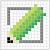

# Icon Editor in Small Basic

This program is a 32 x 32 plane PPM (Portable Pixmap) bitmap editor written in Microsoft Small Basic language. Following files are used to run this program.

* IconEditor.exe
* SmallBasicLibrary.dll

## System Requirements

* Windows Vista or later
* .NET Framework 4.5 or later

## Credit
 
* Made with Small Basic badge is designed by [rockycodeshimhe-1332](https://docs.microsoft.com/en-us/answers/questions/210063/guys-i-made-a-nice-small-basic-github-badge.html)
